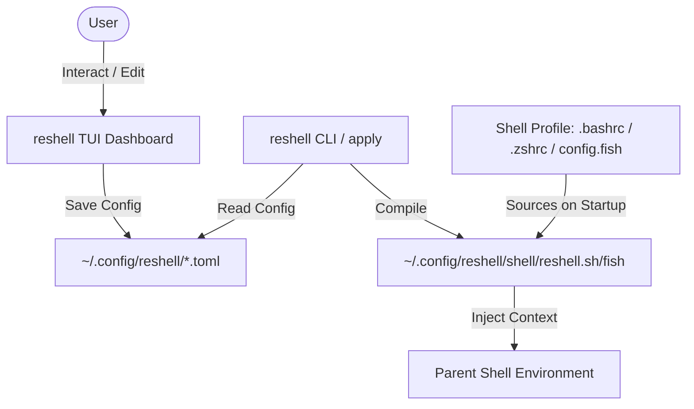

# reshell

[](https://go.dev/)
[](LICENSE)
[](https://github.com/aaryansinhaa/reshell/actions)
[](https://github.com/aaryansinhaa/reshell/pulls)

reshell is a portable developer environment and command-line workspace manager. It provides a terminal dashboard to configure, track, and synchronize aliases, script snippets, shell functions, environment variables, system packages, and git configurations from a single, version-controlled configuration directory.

---

## Tech Stack

- **Language**: Go (1.22+)
- **Terminal User Interface**: Charm Bubble Tea (MVU framework) & Lipgloss
- **Syntax Highlighting**: Chroma rendering engine
- **Supported Shells**: Bash, Zsh, Fish
- **Supported Package Managers**: APT, DNF, Pacman, Homebrew, Winget, Chocolatey

---

## System Architecture



---

## Features

- **CLI Dashboard**: Terminal user interface for managing configurations.
- **Setup Wizard**: Detects installed text editors (Neovim, VS Code, Nano, etc.) to set editor preferences automatically.
- **Syntax Highlighting**: Real-time rendering for scripts, custom functions, and TOML templates.
- **Workspace Workflows**: Non-blocking, multi-step command and browser automation routines.
- **Cross-Platform Package Manager**: Asynchronously installs and uninstalls host packages on Linux, macOS, and Windows with secure sudo password piping.
- **Shell Compiler**: Generates optimized setup scripts and automatically registers startup hooks in `.bashrc`, `.zshrc`, or `config.fish`.
- **Portable Configurations**: Import or export configuration directories as a single TOML manifest or ZIP file.

---

## Installation & Setup

### Prerequisites
- Go 1.22 or higher
- Git

### Build from Source
```bash
git clone https://github.com/aaryansinhaa/reshell.git
cd reshell
go build -o reshell
```

### Setup
Configure global binary path hooks and profile integrations:
```bash
./reshell setup
```
The setup command installs the `reshell` executable to `~/.local/bin/` and registers the startup hooks in your shell profile.

---

## Command Reference

| Command | Action |
| :--- | :--- |
| `reshell` | Launches the interactive TUI Dashboard |
| `reshell apply` | Compiles your active configurations and sources them |
| `reshell clean` | Removes reshell's integration blocks from your shell profile |
| `reshell setup` | Installs reshell binary globally and bootstraps configurations |
| `reshell alias add <name> <value> [desc]` | Registers a command alias |
| `reshell snippet add <name> <code> [desc]` | Stores a code block snippet |
| `reshell snippet copy <name>` | Copies snippet contents to your clipboard |
| `reshell function add <name> <code>` | Creates a custom shell script function |
| `reshell function validate <name>` | Runs a dry-run syntax diagnostic check |
| `reshell script run <cat> <name> [args]` | Runs a library script and writes output logs |
| `reshell workflow run <name>` | Runs a workflow sequence asynchronously |
| `reshell new <template> <name>` | Generates a project skeleton boilerplate |
| `reshell install [repo-url]` | Installs configuration packs or system packages |
| `reshell env add <name> <value>` | Registers environment variables |
| `reshell git apply` | Applies git profiles globally |
| `reshell export <toml-path>` | Exports configurations into a single TOML manifest |
| `reshell import <toml-path>` | Imports configurations from a TOML manifest |

---

## Configuration Architecture

All configurations are stored in your home directory under `~/.config/reshell/`:

```text
~/.config/reshell/
├── config.toml       # User info, preferred editor, packages, marketplace lists
├── aliases.toml      # Active command aliases
├── snippets.toml     # Script snippets & version history
├── env.toml          # Environment variables
├── workflows.toml    # Workflow definitions
├── functions/        # Raw custom function scripts (.sh, .fish)
├── scripts/          # Library scripts grouped by category
└── logs/             # Workflow and script execution logs
```

For comprehensive tutorials, setup guides, and marketplace documentation, refer to the [docs/](docs/) directory.

---

## License

This project is licensed under the MIT License - see the [LICENSE](LICENSE) file for details.
