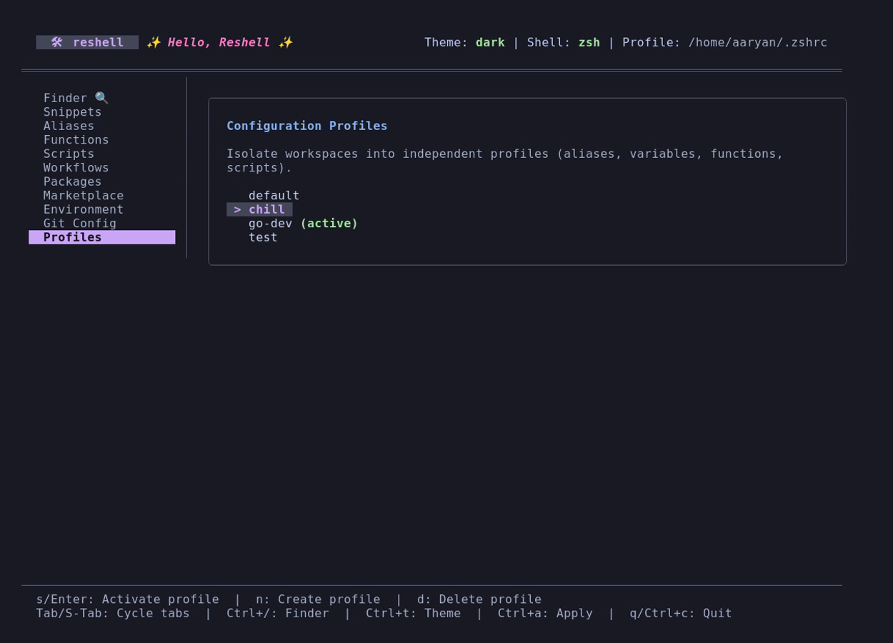

# Getting Started

This guide covers requirements, installation, shell profile integration, and import/export commands.

## Requirements

- **Go**: Version 1.22 or higher.
- **Operating Systems**: Linux, macOS, or Windows (under Unix-compatible environments like WSL, Git Bash, or Cygwin; native CMD/PowerShell are not supported).
- **Git**: Required for configuration version control and importing marketplace packs.

---

## Installation & Setup

### Run via Docker (Sandbox Demo)

For testing or running ReShell in an isolated sandbox without affecting your host system, you can use the pre-built Docker image hosted on GitHub Container Registry:

```bash
docker run -it ghcr.io/aaryansinhaa/reshell:latest
```

### Build from Source

Build the binary from the repository root:

```bash
go build -o reshell
```

Initialize the global configuration, install the binary, inject startup hooks, and auto-discover/import configurations:

```bash
./reshell setup [directory_path]
```

The `setup` command:

1. Copy-installs the `reshell` executable into your local user path (`~/.local/bin/`), registers path variables, and injects shell hook integrations.
2. Prompts you for a target profile name (defaults to `default`). If the profile does not exist, it will be created.
3. Auto-discovers and imports configurations:
   - **Default (No path)**: Automatically scans default home shell profiles (`~/.bashrc`, `~/.zshrc`, `.profile`, `.bash_aliases`, `config.fish`), your `~/.config` folder (excluding cache/tmp/node_modules), global VS Code user snippets, and Pet manager TOML files (`pet.toml`, `snippet.toml`).
   - **Specific Path**: Recursively scans the provided directory path (highly recommended for dotfiles repositories).
4. Prompts you interactively if conflicts are found (e.g., if different alias definitions exist in different files). You can choose to override, keep existing, keep both (by renaming), or skip.
5. Automatically detects secrets (e.g., tokens, credentials, AWS keys) and skips them by default to protect your plaintext configuration. (Note: Although `reshell`'s Git history is purely local, skipping secrets keeps your environment safe).

---

## Active Shell Integration

reshell compiles your configurations and hooks them into your startup profile. Run:

```bash
reshell apply
```

This generates shell-specific script outputs and registers startup hooks:

- **Zsh**: Adds integration blocks to `~/.zshrc` and compiles imports to `~/.config/reshell/shell/reshell.sh`.
- **Bash**: Adds integration blocks to `~/.bashrc` and compiles imports to `~/.config/reshell/shell/reshell.sh`.
- **Fish**: Adds integration blocks to `~/.config/fish/config.fish` and compiles imports to `~/.config/reshell/shell/reshell.fish`.

### Startup Hook Structure

The injected configuration block in your shell profile:

```bash
# >>> reshell initialize >>>
if [ -f "$HOME/.config/reshell/shell/reshell.sh" ]; then
    . "$HOME/.config/reshell/shell/reshell.sh"
fi
# <<< reshell initialize <<<
```

To clean all reshell integration blocks and restore your profile files, run:

```bash
reshell clean
```

---

## Configuration Portability (Import & Export)

To prevent configuration drift, you can export and import your workspace configuration as a unified TOML manifest or back up the raw config folder.

### Conflict Resolution (Last-Write-Wins Policy)

reshell uses a **Last-Write-Wins** conflict resolution policy when merging configurations:

- **Manifest Imports (`reshell import`)**: Overwrites the existing local configurations with the contents of the imported TOML manifest file. A warning prompt is shown to verify if you trust the source repository before writing custom functions or scripts.
- **Marketplace Packs (`reshell install`)**: Fetches the configuration pack manifest, presents a summary breakdown of all environment variables, aliases, snippets, custom functions, and library scripts to be installed, warns about running third-party scripts, performs automated secret scanning, and prompts for explicit trust confirmation before merging. Merges are performed item-by-item. If an imported alias, environment variable, or snippet matches an existing local key, the imported value overwrites the local one.
- **Git Version Control**: Since reshell automatically commits all changes under `~/.config/reshell/`, you can inspect diffs and resolve conflicts or revert undesired overwrites using standard Git command-line tools.

### Exporting Configurations

To export environment variables, aliases, snippets, package lists, and workflows into a single TOML manifest:

```bash
reshell export ~/backup-config.toml
```

### Importing Configurations

To import configurations from a manifest and merge them with your current setup:

```bash
reshell import ~/backup-config.toml
```

Once imported, execute `reshell apply` to compile and source the new configuration.

---

## Dashboard Usage

To launch the interactive configuration editor, run the binary without any subcommands:

```bash
reshell
```

### Keyboard Shortcuts
- `Tab`: Navigate forward through sidebar tabs.
- `Shift+Tab`: Navigate backward through sidebar tabs.
- `Up / Down` (or `k / j`): Scroll item lists.
- `n`: Create a new entry (opens input form).
- `e`: Open the selected custom function or script in your default editor (`$EDITOR`).
- `d`: Delete the selected entry.
- `Space`: Toggle the active state of an environment variable or alias.
- `c`: Copy the selected script snippet to the system clipboard.
- `x`: Execute the selected script or workflow.
- `h` (inside Git tab): Toggle between global git configuration and local repository version history.
- `r` or `Enter` (inside Git history view): Revert configuration files to the selected revision.
- `Ctrl+A`: Run `reshell apply` to compile and load configurations.
- `q` or `Ctrl+C`: Exit the interface.

---

## Multi-Profile Workspaces

reshell supports isolated workspaces through **Profiles**. Each profile maintains its own custom aliases, snippets, custom function scripts, scripts library, environment variables, workflows, and package lists.

<p align="center">
  
</p>

### Managing Profiles in TUI

Navigate to the **Profiles** tab in the TUI dashboard:

- **`s` or `Enter`**: Activates the highlighted profile and automatically compiles and updates your shell hooks (`reshell apply`).
- **`n`**: Prompts you for a name to create and switch to a new profile.
- **`d`**: Deletes the highlighted profile (you cannot delete the active profile).

### Managing Profiles in CLI

You can also control profiles directly from the command line:

- **List profiles**:
  ```bash
  reshell profile list
  ```
- **Create profile**:
  ```bash
  reshell profile create work
  ```
- **Switch profile**:
  ```bash
  reshell profile switch work
  ```
- **Delete profile**:
  ```bash
  reshell profile delete work
  ```

### Isolated Version Control Histories

Each configuration profile maintains its own **completely isolated Git history**:

- Custom profiles store their version histories inside `~/.config/reshell/profiles/<name>/.git/`.
- The default profile stores its history at the root of `~/.config/reshell/.git/` and automatically ignores custom profiles to prevent overlap.
- Swapping profiles switches the TUI History panel to show commits specific to that profile only.

#### Clearing Version History

If you want to discard your profile's version control history and start fresh with a clean initial snapshot:

- **TUI Dashboard**: Go to the **Git** tab, toggle **History View** (using `h`), and press **`c`**.
- **CLI Terminal**: Run the following subcommand:
  ```bash
  reshell git clear
  ```
