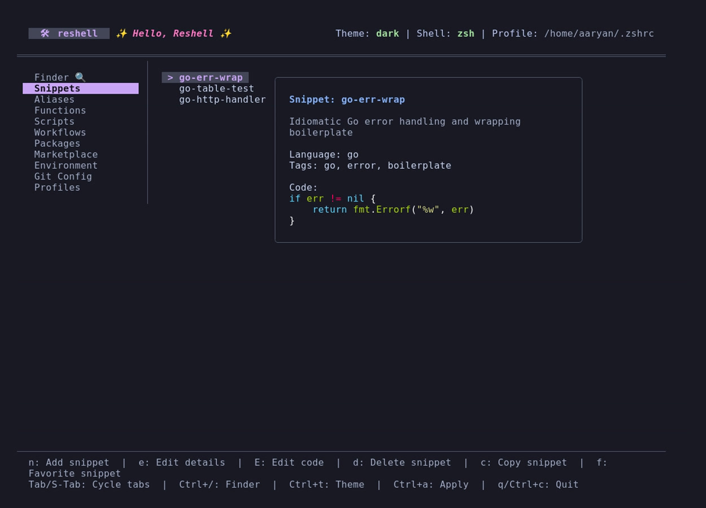
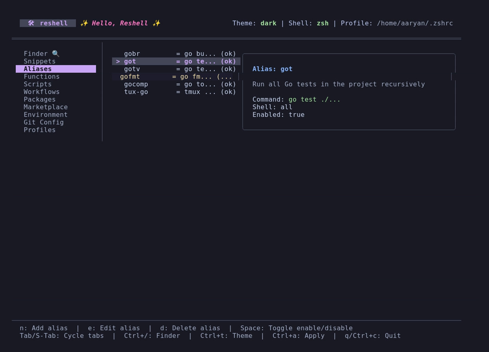

# Snippets & Aliases

This section explains how to manage script snippets and shell command mappings.

---

## Snippets

Snippets are reusable code blocks or templates stored in `~/.config/reshell/snippets.toml`.

<p align="center">
  
</p>

### Adding Snippets

Create a snippet using the command-line interface:

```bash
reshell snippet add <name> <code> [description] [--tags <tags>] [--lang <language>]
```

Options:

- `-t, --tags`: Comma-separated tags (e.g. `--tags "docker,infra"`).
- `-l, --lang`: Programming/scripting language (lexer syntax) of the snippet (e.g. `--lang "python"`). Defaults to `bash`. If an unrecognized language is entered, a warning is printed and it falls back to `bash`.

Alternatively, open the dashboard (`reshell`), navigate to the **Snippets** tab, and press `n` to open the creation form.

### Dashboard Actions

- **Editing Details (`e`)**: Opens a TUI input form to edit snippet metadata (Name, Description, Tags, and Language). If you change the Name, the snippet will be renamed.
- **Editing Code (`E`)**: Opens the selected snippet code block in a temporary `.txt` file using your preferred terminal text editor (defined by `$EDITOR` or `config.toml`). Snippets are written as plain `.txt` files to prevent text editors from forcing incorrect formatting on multi-language snippets.
- **Copying (`c` or `Enter`)**: Copies the highlighted snippet code directly to the host system clipboard.
- **Favorite (`f`)**: Toggles the favorite status of the highlighted snippet. Favorite snippets are highlighted with a star (`★`) symbol in the sidebar.

---

## Aliases

Aliases map command shortcuts to longer terminal commands. They are stored in `~/.config/reshell/aliases.toml`.

<p align="center">
  
</p>

### Conflict Verification

When creating or modifying an alias, the engine verifies the name to prevent collision issues:

1. **System Path Check**: Verifies if the alias name collides with an existing binary in your `$PATH` (e.g., `ls` or `grep`).
2. **Function Verification**: Checks if a custom shell function is already registered with the same name.
3. **Duplicate Check**: Checks for duplicates in your existing alias list.

Warnings are displayed if conflicts are found, but you can override them if needed.

### Toggling State

To temporarily disable an alias, highlight it in the **Aliases** tab of the dashboard and press `Space`. Disabled aliases are excluded from the compiled configuration script during the next `reshell apply` execution.
